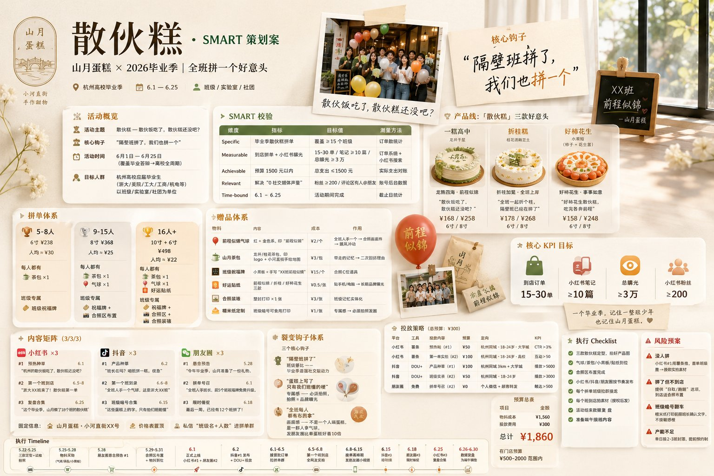

# 给请不起营销的小店（大店更是没问题）做的热点活动营销助手

> 10分钟出一个大牌级热点策划案。让一家只有 2 个人的奶茶店，也能像喜茶一样追着热点做营销。

---

## 一、这是什么

只要告诉它你的店在哪、卖什么、有什么困境，10分钟内帮你：

- 🔥 扫描当前热点（抖音热榜、小红书趋势、本地活动、营销日历）
- 🎯 匹配最适合你的方向
- 💡 出 2-3 个策划概念让你选
- 📄 输出完整 SMART 策划案（内容矩阵+活动机制+投放策略+预算）
- 📸 全链路视觉触点规划 → 提示词 → Board预览 → 精确生图
- 🖼️ 生成一目了然的 Campaign One-Pager 方案全景图（爽！）

---

## 二、解决的痛点

### 2.1 中小门店的营销现实

| 现实 | 数据/事实 |
|------|----------|
| 全国中小门店 | 超过 **9000 万家**（含个体工商户） |
| 有专业营销团队的 | 不足 **3%** |
| 月营销预算 | 多数在 **0-5,000 元** |
| 最常做的营销 | "发朋友圈" 和 "挂个打折牌" |
| 蹭热点能力 | 几乎为零——热点来了不知道、知道了不会追、追了追不上 |

### 2.2 三个核心痛点

**痛点 1：热点来了不知道。**
抖音热榜每小时更新，小红书趋势瞬息万变，本地活动、政策、节日——一个小店老板根本没时间刷。等他知道的时候，热点已经凉了。

**痛点 2：知道了不会追。**
看到别人疫情期间做社区团购爆了、看到别人借"秋天的第一杯奶茶"卖疯了——但轮到自己就是不知道怎么把你的店跟热点连起来。抄方案吧品类不对，原创吧不会策划。

**痛点 3：追了也追不上。**
咬牙跟风做了个活动，但没内容矩阵（小红书发什么？抖音拍什么？）、没投放策略（钱往哪花？）、没视觉物料（图怎么做？）。最后钱花了，声量没起来。

### 怎么解决

大品牌花几万做一个借势活动，你用这个工具 10 分钟就能出一个同等水准的策划——**热点发现 → 策划匹配 → SMART 方案 → 视觉内容矩阵 → 方案全景图，全链路闭环。**

### 🖼️ 最强亮点：方案全景图（Campaign One-Pager）

什么都不懂的人聊几句，就能搞出这张一目了然的方案图。把整个 SMART 策划案浓缩成一张高端策略看板，活动概览/SMART校验/产品体系/内容矩阵/投放预算/Timeline/KPI 全部浮于柔白玻璃卡片之上——一张图发出去，别人看完整个方案。



---

## 三、怎么用

```
"帮我的店看看最近能追什么"
"最近端午节快到了，我的咖啡店怎么蹭"
"帮我出个七夕方案"
"把策划思路做成方案全景图"
```

---

## 四、核心原则

- **热点驱动** — 只做"这个热点 × 这个门店"的一个爆款，不做 30 天全案
- **SMART 可执行** — 每个产出都具体/可衡量/可达成/相关/有时限
- **两次 Human-in-the-loop** — 方向选一次，策划选一次，不替你做所有决策
- **视觉有实物** — 品牌资产收集 → 全链路触点规划 → 提示词 → Concept Board → 精确生图 → 方案全景图
- **成本透明** — 投放预算精确到元，物料成本逐项列

---

## 五、工作流总览

```
用户输入 → 门店快诊 → 热点雷达 → 方向匹配(用户选) → 策划匹配(用户选) → SMART策划案 → [视觉规划] → [方案全景图/Dashboard]
```

---

## 六、技术栈

### 调研层
| 工具 | 用途 |
|------|------|
| **douyin-hot-trend** | 抖音实时热榜 TOP 50 抓取 |
| **WebSearch + WebFetch** | 小红书趋势、本地活动、营销日历、竞品动态、成功案例 |
| **meituan MCP** | 周边竞品餐饮/茶饮数据 |

### 策划层
| 工具 | 用途 |
|------|------|
| **shortvideo-hook** | 短视频爆款钩子生成（悬念/痛点/反差等5类） |
| **营销技能库** | social-content、copywriting、paid-ads、launch-strategy 等 23 个专业模块 |

### 视觉层
| 工具 | 用途 |
|------|------|
| **视觉关键词库** | 光质/光向/构图/视角/景深/质感/风格流派 等 10 大模块专业摄影关键词 |
| **GPT Image 2** | AI 生图（支持通过 image图像生图 skill 自定义 API） |
| **Python PIL** | Concept Board 拼图预览，自动网格排列 |

### 交付层
| 工具 | 用途 |
|------|------|
| **tencent-docs MCP** | 策划案写入腾讯文档在线协作 |
| **Campaign One-Pager** | 方案全景图——策划MD+固定prompt → GPT Image 2 生成高端策略看板 |
| **HTML Dashboard** | 备选：可交互策划看板（呼吸感动效、Tab切换、响应式） |
| **本地 Markdown** | 离线交付，完整可执行 |

### 效率对比
| 环节 | 传统营销部 | AI Agent |
|------|-----------|----------|
| 热点调研 | 1-2 天 | 30 秒 |
| 策划方案 | 2-3 天 | 5 分钟 |
| 视觉物料 | 3-5 天（设计师） | 10 分钟 |
| 总耗时 | 1-2 周 | **10 分钟** |
| 总成本 | ¥5,000-15,000 | **API 成本可忽略** |

---

## 七、真实案例

### 山月蛋糕 × 毕业季 → 「散伙糕」

杭州原创蛋糕店，开了 8 个月小红书 0 粉丝。用本工具 10 分钟锁定毕业季方向，产出「散伙糕」策划案：

- **产品**：三款好意头蛋糕（一糕高中/折桂糕/好柿花生）
- **机制**：全班拼单 + 每人送气球 + 蛋糕上印班级暗号
- **裂变**：靠"隔壁班拼了我们也拼一个"同系内卷传播
- **预算**：¥1,860（物料 ¥1,560 + 投放 ¥300）
- **目标**：覆盖 15-30 个班，曝光 3 万+

📄 [查看完整策划案](cases/散伙糕_SMART策划案.md)

**AI 生成的门店活动场景想象图：**


---

## 八、文件结构

```
小店热点营销助手/
├── SKILL.md                      # 完整6阶段工作流文档
├── README.md                     # 项目说明
├── references/
│   ├── 视觉关键词库.md             # 专业级AI生图关键词库（10大模块）
│   ├── campaign-one-pager-prompt.md # 方案全景图固定Prompt（不可删减）
│   └── dashboard-template.html    # 可复用HTML Dashboard模板（备选）
├── examples/
│   ├── demo_wutong.py             # 示例：梧桐咖啡×愚园路落叶季
│   └── test_store.yaml            # 测试门店数据模板
├── cases/
│   └── 散伙糕_SMART策划案.md       # 完整案例
└── assets/
    ├── campaign-one-pager.jpg      # 方案全景图效果预览（散伙糕案例）
    └── store-scene-3d.png          # 散伙糕案例·AI生成门店活动场景
```

---

## 九、许可

MIT
